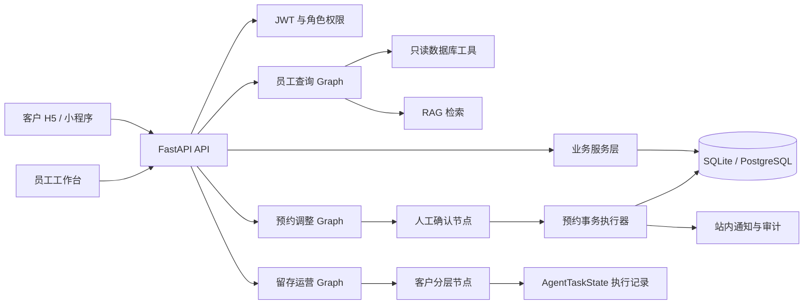
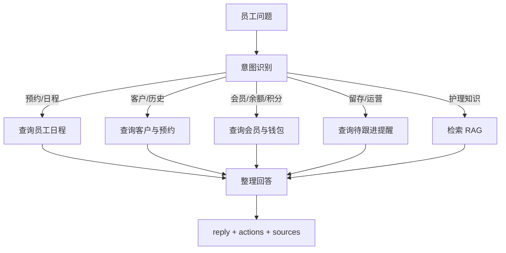
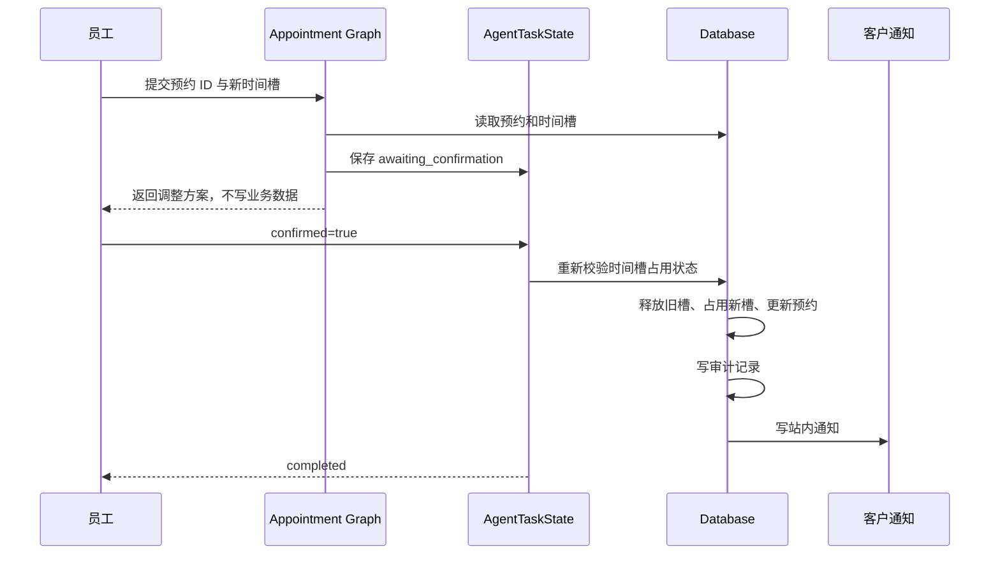

# 恒艺美发架构与流程

## 1. 总体架构



## 2. 员工只读查询



数据库查询和 RAG 查询必须分开。预约、余额、积分是实时数据，必须查数据库；护理规则和知识是文档数据，使用 RAG 检索。

## 3. 预约调整与人工确认



确认接口会重新校验，而不是相信提议阶段的旧结果。这样可以处理员工等待确认期间时间槽被其他人占用的情况。

## 4. RAG 降级策略

```text
护理问题
  -> Chroma 向量检索（启用并且 embedding 可用）
  -> 失败或未启用
  -> 本地 jieba + BM25 检索
  -> 仍没有结果
  -> 返回明确的“未检索到”提示
```

MCP 当前没有接入。项目内部工具由 LangGraph 直接调用已经满足 v1 目标；未来如果多个 Agent 需要跨进程共享数据库、文件或第三方系统工具，再增加 MCP Server/Client。

