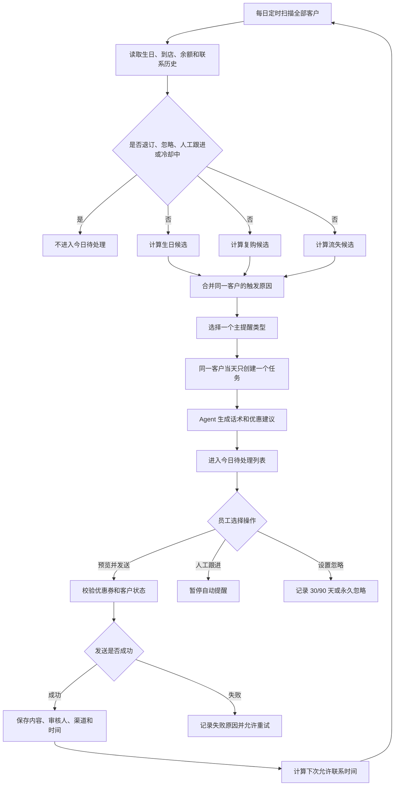
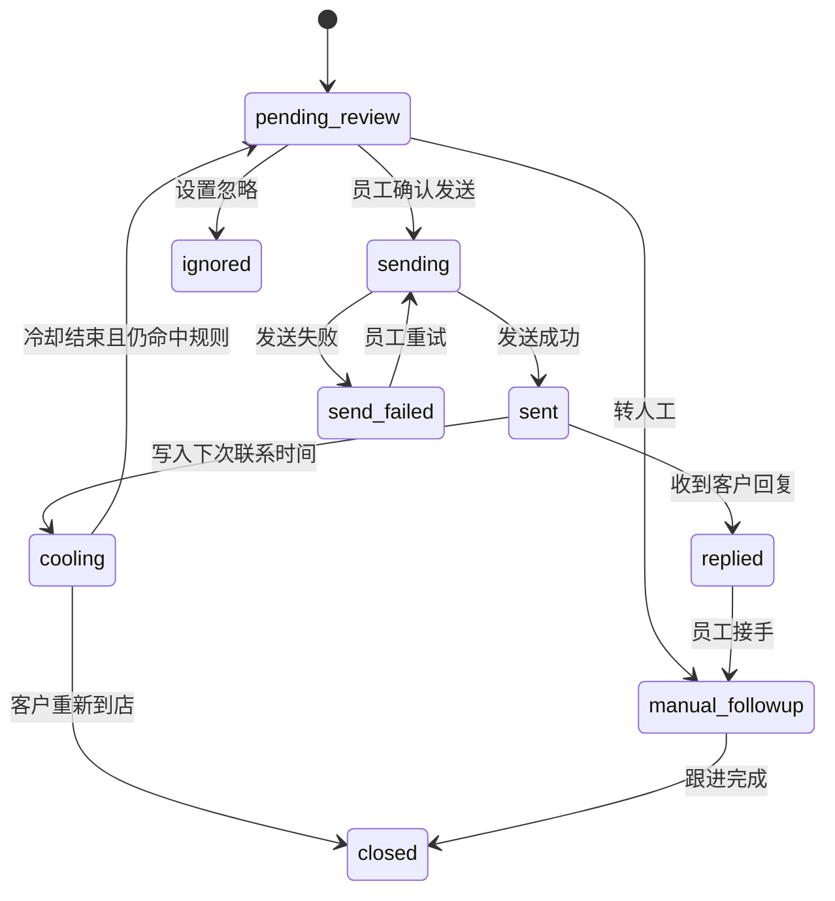

# 留存提醒完整优化方案

> 文档状态：方案评审稿  
> 适用范围：员工工作台「留存提醒」完整板块  
> 覆盖业务：生日提醒、复购提醒、流失风险  
> 第一版原则：规则筛选、Agent 建议、员工确认、模拟发送、完整留痕

## 一、为什么要重做留存提醒

留存提醒不能只是把三类客户分别列出来。员工真正需要的是一个每天可以直接处理的工作台：系统先判断哪些客户今天允许联系，再告诉员工为什么联系、建议说什么，以及联系后什么时候才能再次触达。

本次方案把以下三类业务放进同一套流程：

- **生日提醒**：在生日到来前进行关怀和预约提醒。
- **复购提醒**：客户超过自己的正常到店周期后，提醒员工跟进。
- **流失风险**：客户长期未到店时，进入更谨慎的召回流程。

三类提醒共享退订、忽略、人工跟进、冷却期和联系记录，避免同一个客户因为同时命中多条规则而被连续打扰。

### 大白话解释

以前更像是三个名单：生日名单、该复购名单、快流失名单。优化后它是一张真正的今日待办表。程序会先做一次总检查，确定客户今天能不能联系，然后才让 Agent 帮员工写话术。

## 二、设计目标

系统需要做到：

1. 每天自动扫描客户，但重复执行不会重复创建任务。
2. 同一客户同一天最多只有一个有效留存任务。
3. 三类提醒使用同一套防打扰规则。
4. 明确规则由程序计算，Agent 不能绕过。
5. Agent 只能推荐后台真实存在且可用的优惠券。
6. 第一版必须由员工审核后才能发送。
7. 发送成功、失败、回复、忽略和人工跟进都能追溯。
8. 页面默认只显示今天可以处理的客户。
9. 员工能解释每个客户为什么出现在列表中。

## 三、角色分工

| 模块 | 负责什么 | 不负责什么 |
|---|---|---|
| 规则引擎 | 日期计算、复购周期、150 天流失线、冷却期、退订、忽略、冲突合并 | 不生成营销承诺，不决定虚构优惠 |
| Retention Agent | 汇总客户信息、选择话术策略、生成可编辑消息、推荐有效优惠券 | 不决定客户是否允许联系，不直接发送 |
| 员工工作台 | 展示今日任务、审核消息、选择优惠券、发送、人工跟进、设置忽略 | 不在前端自行计算核心业务规则 |
| 消息渠道 | 模拟发送或调用微信接口，返回发送结果 | 不决定发送对象和营销策略 |
| 数据库 | 保存任务、联系、回复、忽略、审核和失败记录 | 不用单个真假字段代替完整历史 |

## 四、完整业务流程



## 五、统一拦截规则

系统必须先判断客户是否允许联系，再判断属于哪类提醒。执行优先级如下：

```text
明确退订
  > 永久忽略
  > 限时忽略
  > 正在人工跟进
  > 全局冷却期
  > 生日 / 复购 / 流失业务规则
```

| 客户状态 | 是否进入今日待处理 | 处理方式 |
|---|---:|---|
| 明确拒绝营销消息 | 否 | 永久禁止自动触达 |
| 永久忽略 | 否 | 只能由有权限员工重新开启 |
| 30/90 天忽略期内 | 否 | 到期后重新参与扫描 |
| 客户已回复且人工未完成跟进 | 否 | 交给员工处理 |
| 上次成功发送后仍在冷却期 | 否 | 等待下次允许联系时间 |
| 只有发送失败记录 | 是 | 不进入冷却，可重试 |
| 没有有效联系方式 | 否 | 标记资料不完整，提示员工补充 |

## 六、三类提醒规则

### 6.1 生日提醒

建议默认规则：

- 客户生日在今天至未来 5 天内，生成生日候选。
- 同一个客户每个自然年度最多成功发送一次生日提醒。
- 生日联系成功后，设置 14 天全局留存冷却期。
- 没有生日信息或生日格式不合法时不生成任务。
- 2 月 29 日客户在非闰年的处理方式需要固定，建议按 2 月 28 日提醒，并在规则配置中说明。
- 生日话术以关怀和提前预约为主。
- 只有后台确实存在生日优惠时才能写入具体权益。

禁止出现：

- 未配置活动却说“送您一次护理”。
- 没有有效期数据却说“生日券马上过期”。
- 为提高转化而虚构礼品、折扣或库存。

### 6.2 复购提醒

复购提醒根据客户自己的到店节奏计算，不给所有客户使用同一个固定天数。

```text
有至少 2 次有效到店记录
  -> 根据历史到店间隔计算个人平均周期

历史记录不足
  -> 根据最近服务项目使用默认周期

服务信息也不足
  -> 使用全局默认周期
```

建议默认服务周期：

| 服务 | 默认周期 |
|---|---:|
| 剪发 / 洗剪吹 | 28 天 |
| 染发 | 49 天 |
| 烫发 | 56 天 |
| 护理 / 头皮护理 | 30 天 |
| 其他或未知 | 35 天 |

进入条件：

```text
距上次到店天数 >= 个人周期 × 1.2
并且距上次到店天数 < 150 天
```

联系成功后默认 30 天内不再生成新的自动留存任务。客户重新到店后，以新的到店时间重新计算周期。

### 6.3 流失风险

统一使用以下边界：

```text
距上次到店天数 >= 150 天
```

这里使用“大于等于 150 天”，避免“超过 150 天”和“150 天以上”两种说法产生边界差异。

流失客户再根据余额调整策略：

| 客户情况 | 提醒类型 | 策略标签 | 成功发送后的冷却期 | 推荐方向 |
|---|---|---|---:|---|
| 150 天以上且无余额 | 流失风险 | 普通流失 | 50 天 | 老客关怀，可推荐有效回归优惠 |
| 150 天以上且有余额 | 流失风险 | 余额客户 | 30 天 | 提醒真实余额并给出消费建议 |

“余额客户”不是第四种提醒类型，而是流失或复购任务上的策略标签。这样可以避免同一客户同时生成“流失风险”和“余额客户”两条任务。

余额提醒禁止制造虚假紧迫感，例如没有规则依据时不能说“余额即将清零”或“今天不用就失效”。

## 七、生命周期分层

三类业务中，复购和流失属于同一条客户生命周期，因此必须互斥：

| 当前情况 | 系统分层 | 是否进入今日任务 |
|---|---|---:|
| 未达到个人周期的 1.2 倍 | 正常客户 | 否 |
| 达到个人周期的 1.2 倍但不足 150 天 | 复购提醒 | 是 |
| 达到或超过 150 天 | 流失风险 | 是 |

生日属于独立时间事件，所以可能与复购或流失同时命中，需要进行冲突合并。

## 八、同一客户命中多条规则时怎么处理

### 8.1 合并原则

- 同一客户同一天只允许存在一个有效留存任务。
- 一个任务可以保存多个触发原因。
- 页面展示一个主提醒类型和若干辅助标签。
- 不能把多条营销话术强行拼成一条很长的消息。

### 8.2 建议优先级

```text
生日提醒
  > 有余额的流失风险
  > 普通流失风险
  > 复购提醒
```

生日优先是因为生日窗口只有几天，而且关怀比直接召回更自然。假设客户同时满足“3 天后生日”和“160 天未到店”，当天生成一条生日主任务，同时展示“长期未到店”辅助原因。生日联系后先进入 14 天冷却，冷却结束仍未到店时再进入流失任务。

### 8.3 示例

| 客户情况 | 最终任务 |
|---|---|
| 3 天后生日，距离上次到店 40 天 | 生日提醒 |
| 2 天后生日，距离上次到店 170 天，有余额 | 生日提醒，附带“流失风险、余额客户”标签 |
| 距上次到店 80 天，已达到个人周期 1.2 倍 | 复购提醒 |
| 距上次到店 170 天，无余额 | 流失风险 |
| 距上次到店 170 天，有余额 | 流失风险，附带“余额客户”标签 |

## 九、联系频率与冷却期

冷却期从消息**实际发送成功时间**开始计算，而不是从任务生成时间、员工预览时间或发送失败时间开始。

| 成功联系策略 | 建议冷却期 |
|---|---:|
| 生日提醒 | 14 天，并且当年不再发送生日提醒 |
| 复购提醒 | 30 天 |
| 普通流失风险 | 50 天 |
| 有余额的流失风险 | 30 天 |

冷却期是全局留存冷却。例如客户刚收到生日消息，冷却期内即使达到流失线，也不会再次进入今日待处理。

下次允许联系时间计算公式：

```text
next_contact_at = sent_at + 当前发送策略的冷却天数
```

## 十、任务状态设计

建议状态如下：

| 状态 | 含义 | 是否显示在今日待处理 |
|---|---|---:|
| `pending_review` | 等待员工审核 | 是 |
| `sending` | 正在调用消息渠道 | 否，防止重复点击 |
| `sent` | 已发送成功 | 否 |
| `send_failed` | 发送失败 | 是，可重试 |
| `replied` | 客户已回复 | 否，转人工 |
| `manual_followup` | 人工正在跟进 | 否 |
| `cooling` | 尚未到下次允许联系时间 | 否 |
| `ignored` | 限时或永久忽略 | 否 |
| `closed` | 已到店、已完成跟进或任务失效 | 否 |

状态流转：



## 十一、Agent 职责边界

### 11.1 Agent 可以做

- 汇总生日、距上次到店天数、个人复购周期和计算依据。
- 汇总余额、常用服务、消费偏好、常用发型师和联系历史。
- 判断适合使用生日关怀、复购提醒、余额服务提醒还是流失关怀语气。
- 生成一条员工可编辑的微信消息。
- 从后台有效优惠券中推荐一张，并解释原因。
- 客户回复后总结内容并建议下一步人工操作。

### 11.2 Agent 不可以做

- 绕过退订、忽略、人工跟进和冷却期。
- 修改 150 天边界或冷却天数。
- 自己创建优惠券或虚构优惠。
- 编造客户生日、余额、有效期、消费记录或库存。
- 第一版未经员工确认直接发送。
- 在发送失败后擅自标记为成功。

### 11.3 建议的结构化输入

```json
{
  "customer": {},
  "primary_type": "birthday | repurchase | churn_risk",
  "trigger_reasons": [],
  "days_since_last_visit": 0,
  "cycle_days": 0,
  "balance": 0,
  "contact_history": [],
  "available_coupons": []
}
```

### 11.4 建议的结构化输出

```json
{
  "strategy": "birthday_care",
  "message": "员工可以修改的建议话术",
  "coupon_id": null,
  "coupon_reason": "当前没有合适的有效优惠券",
  "risk_flags": []
}
```

后端必须再次校验 `coupon_id` 是否真实、有效、有库存，并且适用于当前客户。不能因为 Agent 输出了一个编号就直接发送。

## 十二、员工页面方案

### 12.1 页面导航

留存提醒页面分为两个主视图：

- **今日待处理**：默认视图，只显示今天允许处理的客户。
- **联系记录**：查询已发送、已回复、冷却中、已忽略和发送失败记录。

规则说明不应占据大面积首屏，可放在“规则说明”按钮打开的侧栏中。

### 12.2 今日待处理

顶部显示简洁统计：

```text
今日待处理 24    生日 3    复购 14    流失风险 7    发送失败 1
```

使用分段筛选切换类型：

```text
[全部 24] [生日 3] [复购 14] [流失风险 7]
```

辅助筛选包括：

- 客户姓名或手机号搜索。
- 负责人筛选。
- 余额客户筛选。
- 优先级排序。
- 发送失败筛选。

### 12.3 主表格字段

| 字段 | 展示内容 |
|---|---|
| 客户 | 姓名、手机号、常用发型师 |
| 提醒类型 | 生日、复购或流失风险；余额作为标签 |
| 触发原因 | 生日倒计时、距上次到店天数、周期依据 |
| 联系情况 | 距上次成功联系多久、最近结果 |
| 下次可联系 | 今天可联系，或具体日期/剩余天数 |
| Agent 建议 | 话术摘要、优惠券、推荐理由 |
| 负责人 | 当前处理员工 |
| 操作 | 预览发送、人工跟进、更多操作 |

### 12.4 任务详情抽屉

点击一行后打开侧边详情，不跳离当前列表。详情包含：

- 客户基础信息和联系方式。
- 最近到店、服务项目和个人复购周期。
- 余额和会员信息。
- 本次所有触发原因。
- 历史联系时间线。
- 可编辑消息输入框。
- 有效优惠券选择器。
- Agent 推荐理由和风险提示。
- 确认发送、转人工、设置忽略按钮。

### 12.5 忽略操作

点击忽略后必须弹出表单，不能使用含义不清的单按钮：

```text
忽略 30 天
忽略 90 天
永久忽略
原因（可选）
```

如果原因选择“客户明确拒绝接收”，系统应提示员工是否将其记录为永久退订。退订属于高风险操作，需要二次确认和审计记录。

## 十三、数据设计

当前 `ReminderLog` 只能表达待联系、已联系和已忽略，无法完整回答“谁审核、发了什么、是否失败、何时可再次联系”。建议拆分职责。

### 13.1 留存任务 `retention_tasks`

至少保存：

- 客户、负责人、业务日期。
- 主提醒类型和辅助标签。
- 所有触发原因及计算证据快照。
- 优先级和当前任务状态。
- 任务生成时间、规则版本和 Agent 任务编号。
- 建议消息、建议优惠券和推荐理由。
- 下次允许联系时间。

建议建立同一客户同一业务日期的唯一约束，保证每日扫描重复执行时不会重复创建。

### 13.2 联系记录 `retention_contacts`

至少保存：

- 对应留存任务和客户。
- 审核人、发送人、发送渠道。
- 实际发送内容，而不是只保存 Agent 草稿。
- 实际使用的优惠券。
- 发送开始时间、成功时间和失败时间。
- 发送结果、渠道消息编号和失败原因。
- 客户回复内容、回复时间和后续处理状态。

### 13.3 忽略与退订 `retention_suppressions`

至少保存：

- 客户和抑制类型：限时忽略、永久忽略、退订、人工跟进。
- 开始时间和结束时间。
- 是否永久。
- 原因和备注。
- 操作人和操作时间。
- 解除人、解除时间和解除原因。

## 十四、接口建议

| 方法 | 路径 | 用途 |
|---|---|---|
| `POST` | `/api/retention/scan` | 执行幂等扫描 |
| `GET` | `/api/retention/tasks` | 查询今日任务或历史任务 |
| `GET` | `/api/retention/tasks/{id}` | 查询客户详情、证据和联系历史 |
| `POST` | `/api/retention/tasks/{id}/generate` | 重新生成 Agent 建议 |
| `POST` | `/api/retention/tasks/{id}/send` | 员工审核后发送 |
| `POST` | `/api/retention/tasks/{id}/manual-followup` | 转人工跟进 |
| `POST` | `/api/retention/tasks/{id}/ignore` | 设置 30/90 天或永久忽略 |
| `POST` | `/api/retention/tasks/{id}/retry` | 重试失败发送 |
| `POST` | `/api/retention/tasks/{id}/reply` | 模拟或接收客户回复 |
| `POST` | `/api/retention/tasks/{id}/close` | 完成人工跟进 |

所有改变状态的接口都需要：

- 登录员工身份。
- 参数校验。
- 当前状态校验。
- 幂等或防重复提交处理。
- 审计日志。

## 十五、消息发送设计

第一版微信接口未接通时，使用可替换的发送器接口：

```text
RetentionMessageSender
  ├─ MockMessageSender      模拟发送
  └─ WeChatMessageSender    后续真实微信渠道
```

模拟发送也要走完整流程：

1. 员工预览并编辑消息。
2. 后端重新检查退订、冷却和优惠券状态。
3. 创建发送尝试记录。
4. 模拟返回成功或失败。
5. 成功才写入冷却期。
6. 失败保留任务并允许重试。

这样以后接微信时只替换渠道实现，不需要重写规则、页面和联系记录。

## 十六、异常处理

- 微信发送失败时不进入冷却期。
- 员工连续点击发送时，只允许一个请求真正执行。
- 每日扫描重复执行时不重复创建任务。
- 待处理任务已存在时，不生成第二条新任务。
- 客户发送前刚刚退订时，必须阻止发送。
- 客户发送前刚刚被其他员工联系时，必须阻止重复触达。
- 优惠券过期、下架、库存不足或不适用时，必须重新选择。
- 客户重新到店后，旧复购或流失任务自动关闭。
- 客户回复后暂停自动提醒，直到员工完成跟进。
- Agent 服务不可用时，保留规则生成的任务，使用安全模板或允许员工手写。
- 客户生日或到店数据缺失时，不允许 Agent 猜测。

## 十七、验证方案

### 17.1 生日提醒

- 验证生日还有 6 天的客户不出现，5 天内客户出现。
- 验证今天生日的客户出现。
- 验证同一生日年度只成功发送一次。
- 验证生日与流失同时命中时只生成一个任务。
- 验证没有真实优惠时不会生成“赠送护理”等承诺。

### 17.2 复购提醒

- 验证未达到个人周期 1.2 倍的客户不出现。
- 验证达到阈值且不足 150 天的客户出现。
- 验证历史不足时使用服务默认周期。
- 验证客户重新到店后旧任务关闭并重新计算周期。
- 验证成功发送后 30 天内不重复出现。

### 17.3 流失风险

- 验证 149 天客户不进入流失风险。
- 验证 150 天客户进入流失风险。
- 验证无余额客户使用 50 天冷却。
- 验证有余额客户使用 30 天冷却和余额策略。
- 验证余额客户不会额外生成第四条任务。

### 17.4 全局规则

- 验证退订客户永远不进入今日任务。
- 验证忽略 30 天、90 天和永久忽略分别生效。
- 验证客户回复后暂停自动召回。
- 验证发送失败不进入冷却期。
- 验证同一客户同一天只有一个有效任务。
- 验证同一扫描重复执行不产生重复数据。
- 验证不同员工同时发送时只有一次成功。
- 验证优惠券发送前会再次校验有效性和库存。

## 十八、分阶段实施建议

### 第一阶段：统一规则引擎

- 固定生日、复购和流失的边界。
- 增加跨类型冷却和拦截规则。
- 增加候选合并和主提醒选择。
- 补齐纯规则单元测试。

这一阶段不改页面，先保证“谁该出现”计算正确。

### 第二阶段：补齐数据和接口

- 数据库迁移。
- 增加完整联系记录和忽略记录。
- 扩展任务状态。
- 实现发送、失败重试、人工跟进和忽略接口。

### 第三阶段：收紧 Agent 边界

- Agent 只分析规则筛选后的客户。
- 使用结构化输入输出。
- 优惠券必须从有效列表中选择。
- 增加模型不可用时的安全降级。

### 第四阶段：重构留存工作台

- 默认展示今日全部待处理任务。
- 增加三类分段筛选、搜索和状态筛选。
- 增加任务详情抽屉、消息编辑和优惠券选择。
- 增加联系记录视图和忽略表单。

### 第五阶段：联调与验收

- 模拟完整发送闭环。
- 验证重复扫描和重复点击。
- 验证移动端、键盘操作和错误提示。
- 更新开发总结、架构文档和面试演示脚本。

## 十九、面试话术

### 19.1 一分钟介绍

> 我把留存提醒设计成规则引擎和 Agent 协作的工作台。规则引擎先处理退订、忽略、人工跟进和冷却期，再根据生日窗口、个人复购周期和 150 天流失线计算候选客户。复购和流失互斥，生日与其他规则同时命中时会合并成一个任务，所以同一客户同一天不会出现多条待办。Agent 只负责根据真实消费和联系历史生成个性化话术，并从后台有效优惠券中推荐，最终由员工审核发送。发送成功后保存完整联系记录并计算下次允许联系时间，因此每日任务重复执行也不会重复骚扰客户。

### 19.2 为什么不用大模型直接判断谁该联系

> 日期、冷却期、退订和忽略都是确定性规则，用程序判断更稳定、可测试、可解释。如果交给模型，可能同一客户两次得到不同答案，也可能绕过业务限制。模型更适合处理自然语言和个性化表达，所以我让规则控制资格，让 Agent 负责建议。

### 19.3 为什么余额客户不是单独一种提醒

> 余额只是影响召回优先级、话术方向和冷却期的客户属性，不是一个独立生命周期阶段。如果把它做成第四类提醒，同一个长期未到店客户可能同时收到流失任务和余额任务。因此我把余额设计成流失或复购任务上的策略标签。

### 19.4 为什么需要完整联系记录

> 一个“是否联系过”的布尔值只能回答是或否，不能回答谁联系、什么时候联系、发了什么、是否成功以及何时可以再联系。完整联系记录既支撑冷却规则，也能统计发送成功率、回复率、投诉率和召回效果。

### 19.5 为什么第一版不自动发送

> 留存消息涉及客户体验、优惠成本和微信渠道合规。第一版保留员工审核，可以拦截模型误判和不合适的话术。积累成功率、回复率和投诉数据后，再评估是否只对低风险场景开放自动发送。

## 二十、默认假设与待确认项

本方案暂按以下默认值设计：

- 生日提前 5 天进入提醒。
- 生日成功联系后全局冷却 14 天，每年最多一次。
- 复购阈值为个人周期的 1.2 倍，且只适用于不足 150 天的客户。
- 复购成功联系后冷却 30 天。
- 流失边界为大于等于 150 天。
- 普通流失客户冷却 50 天，有余额流失客户冷却 30 天。
- 人工忽略支持 30 天、90 天和永久。
- 客户退订优先级最高。
- 第一版由员工审核后发送。
- 微信未接通时使用模拟发送。
- 优惠券只能来自后台有效、有库存且适用的优惠券。
- 2 月 29 日生日在非闰年按 2 月 28 日处理，该规则需要业务最终确认。

这些参数后续可以放入后台配置，但第一版应先使用明确常量并补测试，避免为了“可配置”过早增加系统复杂度。

