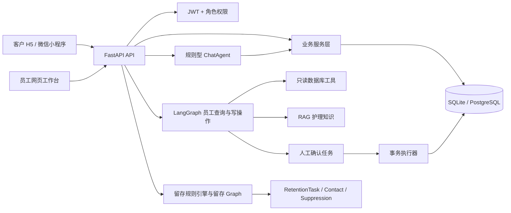
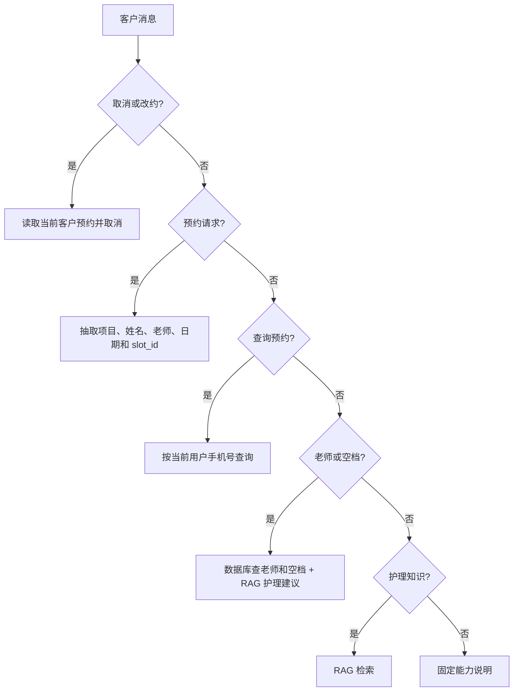
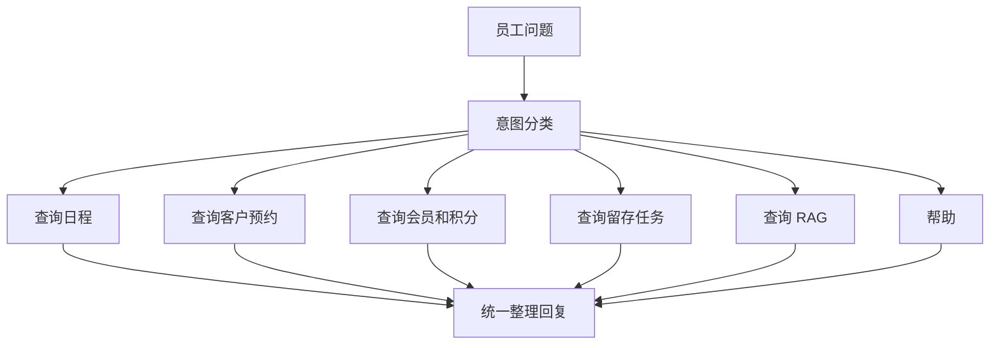
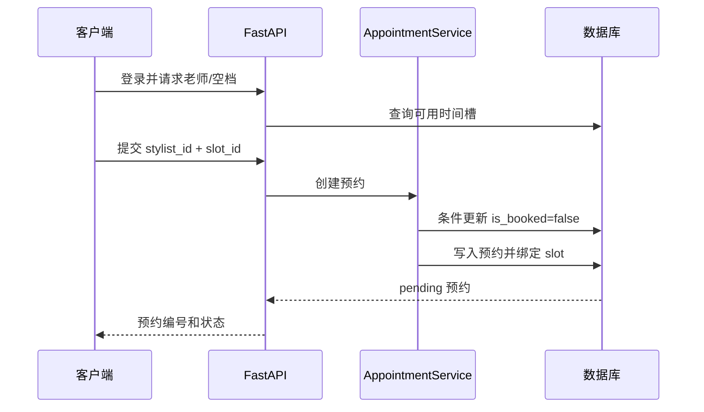
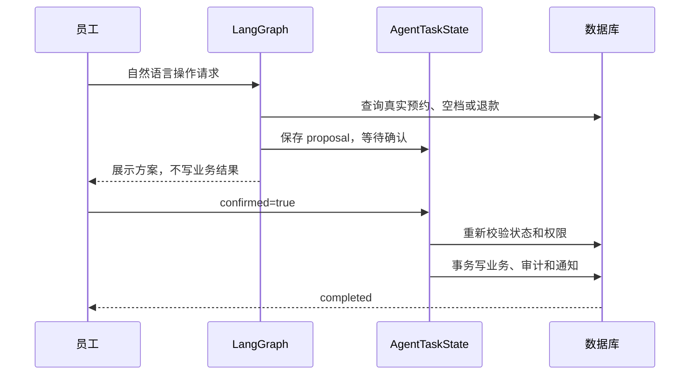

# 恒艺美发 AI Agent 项目报告

审查日期：2026-07-16  
审查对象：`D:\面试项目` 当前工作区代码  
审查方式：代码阅读、静态检查、分组测试、接口反例验证、真实浏览器冒烟检查  
审查结论：**演示级核心流程基本可用，生产环境暂不建议直接上线。**

## 1. 结论摘要

这是一个面向美发门店的智能运营系统，不只是聊天页面。项目把客户预约、员工日程、会员积分、钱包退款、服务核验、留存运营和护理知识问答串成了一个完整业务闭环。

当前项目的优点：

- FastAPI、SQLAlchemy、JWT、Argon2、Alembic 等后端基础设施完整。
- 客户侧使用规则型 ChatAgent，员工侧使用 LangGraph 查询图，写操作有任务状态和人工确认节点，安全思路是对的。
- RAG 同时准备了 Chroma 向量检索、jieba 分词加 BM25、本地关键词兜底三层路径，离线演示能力较好。
- 预约占槽使用条件更新，改约确认阶段重新校验目标时间槽，预约并发测试和 Agent 工作流测试覆盖较完整。
- 留存任务有唯一约束、抑制规则、触达记录、冷却期和失败重试，业务建模比普通 Demo 更深入。
- 客户 H5 和员工工作台可以启动，浏览器实测没有控制台错误，员工首页的主要接口全部返回 200。

必须优先修复的问题：

| 优先级 | 问题 | 直接影响 |
|---|---|---|
| P1 | 客户可以调用 `POST /api/transactions` 自报任意消费 | 可伪造消费、积分、累计消费金额和最近到店时间，污染财务与留存数据 |
| P1 | 客户可以在创建会员时自选 `platinum`，生日也没有合法日期校验 | 可伪造会员等级，错误生日会影响营销名单 |
| P1 | 已完成预约仍然可以被客户取消 | 历史事实被改写，时间槽被错误释放 |
| P1 | 停用账号仍然可以登录并拿到 JWT | 登录接口与账号停用语义不一致，审计和客户端行为容易混乱 |
| P1 | 启动日志会打印完整 `DATABASE_URL` | 生产日志可能泄露数据库用户名、密码和地址 |
| P1 | 充值和留存发送仍是演示实现 | 不能宣称是真实支付和真实微信触达闭环 |
| P2 | 钱包和退款缺少数据库行锁、幂等键和并发账务保护 | 多实例或重复请求时可能出现余额竞争和重复处理 |
| P2 | 限流器是单进程内存实现 | 多 worker、多容器部署时限流不共享，长期运行还有 key 增长问题 |
| P2 | APScheduler 当前运行环境未加载，且多 worker 可能重复执行 | 每日留存扫描不能保证按时执行 |
| P2 | 小程序 API 地址固定为 `127.0.0.1:8001` | 真机上会请求手机自己的回环地址，无法访问后端 |
| P2 | 迁移测试硬编码执行 `alembic.exe` | 当前 Windows 应用控制策略下测试必失败；应改为 Python 模块调用 |
| P2 | 初审时文档写“42 条测试”，实际收集到 115 条；修复阶段新增安全回归后当前为 121 条 | 项目说明与实际状态不一致，已在复审中修正 README |

一句话面试结论：

> 这个项目已经具备可演示的业务闭环和较完整的 Agent 安全边界，但当前更准确的定位是“可验证的工程化原型”。上线前必须先修复客户自写业务数据、预约状态机、生产日志脱敏、真实支付/消息渠道和并发账务一致性。

## 2. 审查范围和当前状态

本次审查基于工作区当前状态，而不是只看 Git 已提交版本。审查开始时工作区存在大量未提交改动，主要集中在 Agent、API 路由、数据库模型、员工端网页、测试和 `开发总结.md`。因此本报告描述的是“当前工作树”，不能直接等同于 `master` 分支最近一次提交。

当前 Git 状态还显示：

- 当前分支为 `master`，相对远端 ahead 3。
- 有大量已修改文件和未跟踪文件。
- `hair_salon.db`、`.env` 和 `output/` 被 `.gitignore` 忽略。
- 本次审查没有修改业务源代码，也没有回滚原有改动。

## 3. 总体架构



系统分层可以用下面这句话解释：

> API 层负责 HTTP 输入输出和权限依赖，Agent 层负责理解意图和编排步骤，Service 层负责业务规则和事务，数据库层负责持久化，前端只负责展示和发起请求。模型不能直接写数据库，写操作要经过后端服务和人工确认。

## 4. 技术栈总表

| 层次 | 技术 | 版本或配置 | 在项目中的用途 | 选择理由 | 当前评价 |
|---|---|---|---|---|---|
| 运行时 | Python | 3.12.4 实测 | 后端、Agent、脚本和测试 | AI 生态、FastAPI、SQLAlchemy 和 LangGraph 都成熟 | 可用 |
| Web API | FastAPI | 0.115.0 | 路由、依赖注入、OpenAPI 文档 | 类型提示和 Pydantic 校验能快速形成清晰 API 合同 | 设计合理 |
| ASGI 服务 | Uvicorn | 0.30.6 | 启动 FastAPI | 轻量、适合开发和容器运行 | 可用 |
| 请求校验 | Pydantic | 2.9.2 | 请求体和响应模型 | 自动生成 422 错误和 Swagger 文档 | 多数接口合理，部分生日/等级字段仍需加强 |
| ORM | SQLAlchemy | 2.0.35 | 模型、查询、事务和关系 | 跨 SQLite/PostgreSQL，便于封装业务查询 | 可用，但财务并发锁不完整 |
| 数据库 | SQLite / PostgreSQL | SQLite 默认，Docker 使用 PostgreSQL 16 | 预约、会员、钱包、Agent 任务和审计持久化 | SQLite 方便离线演示，PostgreSQL 适合生产 | 双数据库兼容需继续压测 |
| 迁移 | Alembic | 1.14.1 | 版本化数据库结构 | 避免依赖 `create_all`，可审查 schema 演进 | 已升级到 0013，迁移测试使用当前 Python 环境 |
| UUID | 自定义 `UniversalUUID` | 项目内部实现 | 兼容 SQLite 字符串 UUID 与 PostgreSQL UUID | 同一套模型支持两种数据库 | 需要继续验证所有迁移和索引 |
| 认证 | PyJWT | 2.10.1 | 签发和校验 JWT | 无状态 API 认证简单直接 | 缺少撤销机制，停用登录逻辑不一致 |
| 密码 | pwdlib + Argon2 | 0.2.1 | 密码哈希和复验 | Argon2 适合密码存储，抗 GPU 暴力破解 | 安全方向正确，测试执行较慢 |
| 权限 | FastAPI Depends + `UserRole` | CUSTOMER / STYLIST / ADMIN | 客户、员工、管理员边界 | 权限依赖集中且可测试 | 个别遗留写接口权限错误 |
| Agent 编排 | LangGraph | 1.x | 员工查询、改约、留存流程、人工确认 | 状态图适合多步骤、暂停和恢复 | 设计合理，路由文件过大 |
| Agent 工具 | LangChain | 1.3.4 | OpenAI-compatible 模型和工具适配 | 接入不同模型供应商成本较低 | 当前模型是可选增强，不是稳定主路径 |
| 模型适配 | `langchain-openai` | 1.3.0 | DeepSeek、OpenAI-compatible、Ollama | 统一兼容接口 | 依赖外部服务时需超时和熔断 |
| RAG 向量库 | ChromaDB | 1.5.9 | 可选向量相似度检索 | 本地可持久化，适合原型 | 需要 embedding 和目录管理 |
| RAG 本地检索 | jieba + rank-bm25 | 0.42.1 / 0.2.2 | 无 API key 时的中文检索降级 | 离线、可复现、成本低 | 作为降级路径合理 |
| 定时任务 | APScheduler | 3.10.4 | 每日 08:30 留存扫描 | 原型接入简单 | 当前环境运行时提示未安装，多 worker 有重复风险 |
| 日志 | Loguru | 0.7.2 | 启动、业务和异常日志 | API 简单、可读性好 | 必须禁止打印完整 DSN 和敏感信息 |
| 客户端 H5 | 原生 HTML/CSS/JavaScript | 无构建工具 | 客户演示、登录、预约、钱包和通知 | 部署简单，面试时容易展示 API 闭环 | Token 放 localStorage 有 XSS 风险 |
| 员工端 | 原生 HTML/CSS/JavaScript | 无构建工具 | 工作概览、Agent、退款、留存和审计 | 低依赖、适合演示 | `staff.js` 体积和职责偏大 |
| 微信客户端 | 微信小程序原生 WXML/WXSS/JS | `touristappid` | 登录、预约、会员、钱包和通知 | 贴近真实微信场景 | 真机 API 地址仍是回环地址 |
| 测试 | pytest + FastAPI TestClient + httpx | pytest 9.1.1 实测 | 单元、接口、Agent、权限和闭环测试 | 能验证状态变化而不是只测静态返回 | 覆盖强但运行慢，迁移测试不跨 Windows |
| 部署 | Dockerfile + Docker Compose | Python 3.12 / PostgreSQL 16 | 容器化应用和数据库 | 便于统一环境 | 生产密钥、迁移和多 worker 策略需加强 |
| MCP | 未接入 | 当前版本 | 没有使用 MCP | 内部工具由 LangGraph 直接调用，v1 可以接受 | 面试时应诚实说明未使用 |

## 5. 模块逐项检查

### 5.1 应用入口、配置和中间件

| 模块 | 主要文件 | 技术栈 | 职责 | 关联模块 | 检查结果 |
|---|---|---|---|---|---|
| 应用入口 | `backend/main.py` | FastAPI lifespan、CORS、StaticFiles | 创建应用、注册路由、挂载 H5 和员工网页、启动调度器 | API、scheduler、middleware、frontend | 基础启动正常；数据库日志分支把任意配置 URL 都写成 PostgreSQL，且会打印完整 DSN |
| 配置 | `backend/config.py` | `os.getenv`、python-dotenv | 加载数据库、LLM、RAG、JWT、CORS 和限流配置 | auth、database、RAG、Docker | 有生产安全校验；配置在导入时读取，运行中修改环境变量不会自动生效 |
| 请求 ID | `backend/middleware.py` | Starlette `BaseHTTPMiddleware` | 为请求生成并回传 `X-Request-ID` | 统一错误、日志和审计 | 通过 |
| 限流 | `backend/middleware.py` | 进程内 deque + Lock | 按客户端 IP 做 API 请求窗口限流 | 入口、生产部署 | 单进程 Demo 可用，不适合多实例；没有清理长期不活跃 key |
| 错误处理 | `backend/api/errors.py` | FastAPI exception handler | 统一返回 `code/message/request_id/details` | 前端错误提示、排障 | 通过；前端员工端仍主要读取 `detail`，没有完全利用统一格式 |

面试话术：

> 我把请求 ID 放在限流之前，这样被限流的请求也能追踪；生产环境会把限流状态放 Redis 或网关，进程内实现只用于单 worker 演示。

### 5.2 认证和权限

| 文件 | 核查点 | 结果 |
|---|---|---|
| `backend/auth/security.py` | JWT `sub/role/exp`、HS256、活动账号查询 | 受保护接口会再次查 `is_active`，大多数权限边界正确 |
| `backend/api/routers.py` | `require_customer`、`require_staff`、`require_admin` | 员工只读 Agent 与管理员写操作基本分离 |
| `frontend/index.html` | H5 Bearer Token | Token 存在 localStorage，遇到 401 会清理 |
| `frontend/staff.js` | 员工 Bearer Token | Token 存在 localStorage，管理员界面由后端权限再次控制 |
| `frontend/miniprogram/app.js` | 小程序 storage + Bearer | 能完成登录和刷新，但回环 API 地址不适合真机 |

已验证的正向行为：

- 未登录创建预约返回 401。
- 客户不能读取员工客户列表。
- 客户不能取消其他客户预约。
- 员工不能使用管理员专属的财务和留存写操作。
- Agent 任务确认要求任务属于当前管理员，并且只允许处于 `awaiting_confirmation` 状态的任务确认。

已发现的权限缺口：

1. `POST /api/transactions` 使用 `require_customer`，客户可以自己写入消费事实。
2. `POST /api/members` 使用客户输入的 `level`，客户可以传 `platinum`。
3. `POST /api/chat` 使用 `get_current_user`，没有强制 `require_customer`，员工也能进入客户聊天编排路径。
4. 登录接口没有在密码校验后立即检查 `is_active`，停用账号仍会拿到 JWT；后续保护接口才会拒绝。

### 5.3 API 和 Pydantic 合同

主要文件：`backend/api/routers.py`、`backend/api/schemas.py`。

接口分组：

| 分组 | 代表接口 | 检查结果 |
|---|---|---|
| 认证 | `/api/auth/register`、`/login`、`/wechat`、`/me` | 注册、登录、微信凭证错误路径已测；停用登录需修复 |
| 客户聊天 | `/api/chat`、`/api/chat/langchain` | 规则 Agent 和无 Key 降级通过；同步逻辑在 async 路由内执行 |
| 员工查询 | `/api/staff/agent/query` | LangGraph、来源、trace 和权限通过 |
| 预约 | `/api/stylists`、`slots`、`appointments` | 占槽并发和闭环通过；完成状态取消缺口已实测 |
| 改约/批复 | `propose`、`tasks/{id}/confirm` | 提议不写库，确认重查空档，流程通过 |
| 会员 | `/api/members`、`/transactions` | 查询边界通过；写入权限和字段信任有问题 |
| 钱包退款 | `/api/wallet`、`/refunds` | 基本流程通过；充值是演示记账，财务并发保护不足 |
| 服务核验 | `verify`、`complete` | 管理员人工核验和服务完成通过；需要继续做并发扣次测试 |
| 留存 | `/api/retention/*` | 规则、任务、发送、失败重试和抑制测试通过；实际发送是 Mock |
| 初始化 | `/api/init-db` | 生产需管理员 JWT；初始化接口本身会填充演示数据，不应暴露到生产 |

关键设计判断：

- Pydantic 负责格式校验，但不能代替业务权限校验。例如 `amount > 0` 只能说明金额格式合法，不能说明客户有权制造一笔消费。
- 所有涉及资金、积分、会员等级、最近到店时间的字段都应从后端事实来源生成，不能直接信任客户端请求体。

### 5.4 数据库模型和业务服务

| 模块 | 主要文件 | 技术点 | 评价 |
|---|---|---|---|
| 连接 | `backend/database/connection.py` | SQLite 文件、PostgreSQL、StaticPool、UniversalUUID | 测试可用内存 SQLite，开发默认落到 `hair_salon.db` |
| 模型 | `backend/database/models.py` | SQLAlchemy ORM、Enum、ForeignKey、JSON、UUID | 领域模型较完整，包含用户、预约、钱包、退款、服务套餐、审计和 Agent 任务 |
| 基础服务 | `backend/database/service.py` | 查询、条件更新、预约占槽 | 占槽条件更新有效；取消服务缺少状态白名单 |
| 财务 | `backend/database/finance.py` | Decimal 转分、钱包流水、退款、通知、审计 | 金额转换方向正确，但并发和幂等不足 |
| 会员 | `backend/database/membership.py` | 余额动态 VIP 等级 | 余额动态展示思路清晰，但创建会员时仍信任客户端等级 |
| 留存 | `backend/database/retention.py` | 周期、生日窗口、流失阈值、抑制、冷却 | 是项目中业务规则最完整的模块之一 |
| 改约事务 | `backend/database/appointment_change.py` | `with_for_update`、审计、通知 | 确认阶段重新锁定预约和目标时间槽，设计合理 |

数据一致性风险：

- `WalletAccount.balance_cents` 有唯一用户约束，但充值、消费、退款读取余额时没有统一的 `with_for_update`。
- 退款申请先汇总 pending 金额再写新申请，没有幂等键；两个并发请求可能同时通过余额检查。
- 服务完成扣钱包时没有把“同一服务核验只能完成一次”的并发语义全部收敛到条件更新或锁中。
- `stylist_time_slots` 没有 `(stylist_id, date, time)` 唯一约束，生成时间槽在多进程并发时可能产生重复槽。
- 交易和累计消费仍使用 Python `float`，钱包使用整数分，两个财务口径没有完全统一。

### 5.5 客户 ChatAgent

主要文件：`backend/agents/chat_agent.py`、`backend/client/appointment.py`、`backend/client/knowledge_query.py`。

流程：



优点：

- 通过当前登录用户身份传递手机号，没有直接信任请求体里的 `phone`。
- 预约时要求 `slot_id` 或明确老师、日期和时间，减少自然语言歧义。
- 客户侧不把模型直接暴露为数据库写入器。

问题：

- 规则识别依赖关键词和正则，复杂表达、同义词、日期和多意图消息仍可能误判。
- `ChatAgent` 内部使用同步数据库调用，API 路由声明为 `async`，高并发时可能阻塞事件循环。
- `/api/chat` 没有强制客户角色，建议只保留客户角色入口，员工使用专门的工作台 Agent。
- 取消动作最终调用的底层服务没有检查预约当前状态，因此完成预约也能被取消。

### 5.6 员工 LangGraph 和写操作 Agent

主要文件：`staff_graph.py`、`staff_intent.py`、`staff_operation_planner.py`、`appointment_change_graph.py`、`tools.py`、`trace.py`。

只读查询图：



写操作图的共同模式：

1. 解析自然语言并识别动作。
2. 查询真实数据，生成结构化 proposal。
3. 把 proposal 写入 `AgentTaskState`，状态变为 `awaiting_confirmation`。
4. 员工在前端确认或拒绝。
5. 确认接口再次查询权限、任务状态、预约/退款/时间槽状态。
6. 在同一数据库事务中写业务数据、审计和客户通知。

这个模式是项目最值得面试展示的设计：模型负责理解和规划，后端负责校验和执行，人工确认负责高风险动作的最后一道闸门。

### 5.7 RAG 模块

主要文件：`backend/rag/knowledge_base.py`、`bm25_index.py`、`retriever.py`、`vector_store.py`。

降级顺序：

```text
Chroma 向量检索（开启且 embedding 可用）
  -> jieba + BM25 本地检索
  -> knowledge_query.py 关键词/分类兜底
  -> 返回未检索到的明确提示
```

优点：

- 文档源集中在 `knowledge_base.py`，没有维护第二套隐藏知识。
- RAG 不承担实时预约、余额和积分查询，实时数据直接查询数据库，边界正确。
- 测试覆盖了七度冷棕、配比、校色、加热、受损发和过敏测试等知识问题。

风险和限制：

- Chroma 首次构建可能调用外部 embedding，启动或第一次查询会变慢。
- 没有看到系统化的离线评测指标、召回率、精确率和版本化评测数据；当前主要是固定问题断言。
- 护理知识属于建议内容，虽然文本中有师傅确认和产品说明书提示，但生产上仍应在 UI 和审计中区分“知识建议”和“专业操作指令”。

### 5.8 留存 Agent 和发送渠道

主要文件：`backend/database/retention.py`、`backend/agents/retention_graph.py`、`backend/retention/sender.py`。

留存规则考虑了个人服务周期、生日窗口、流失阈值、账户余额、忽略、退订、人工跟进和冷却期，并使用：

- `RetentionTask`：某客户某营业日的唯一任务。
- `RetentionContact`：实际触达尝试和结果。
- `RetentionSuppression`：忽略、退订和人工跟进的抑制状态。

这部分设计可解释性较好，测试也覆盖了合并任务、幂等扫描、失败重试、成功后冷却和退订拦截。

但当前发送路径在 `backend/api/routers.py` 约 3776 行固定实例化 `MockMessageSender`。`WeChatMessageSender` 只是预留适配器，不能发送真实微信消息。面试时应说“已抽象发送器接口，当前使用 Mock 验证状态机，真实渠道尚未接入”，不要说成已上线微信触达。

### 5.9 前端模块

| 前端 | 文件 | 检查结果 |
|---|---|---|
| 客户 H5 | `frontend/index.html` | 真实浏览器打开成功，登录首屏无控制台错误；原生 JS 渲染、接口和 localStorage 认证可用 |
| 员工端 | `frontend/staff.html`、`staff.js`、`staff.css` | 登录后 4 张概览卡、营业额、导航和接口请求均正常，控制台 0 错误 |
| 微信小程序 | `frontend/miniprogram/` | 页面配置、JS 和 JSON 静态检查通过；不能用普通浏览器完整模拟微信运行时 |
| 设计稿/静态页面 | `design/`、`hero.html`、`ui-model.html` | 属于演示资产和设计审查材料，不是后端业务主路径 |

真实浏览器验证：

- 客户 H5：`http://127.0.0.1:8001/`，首屏登录表单渲染正常。
- 员工工作台：`http://127.0.0.1:8001/staff`，登录后接口全部返回 200。
- 客户截图：`output/playwright/customer-login-audit.png`。
- 员工截图：`output/playwright/staff-dashboard-audit.png`。
- 浏览器控制台：两页均未发现错误或警告。

前端风险：

- `frontend/miniprogram/app.js:22` 将 API 固定为 `http://127.0.0.1:8001`；真机中的 127.0.0.1 是手机本身，不是开发电脑。
- H5 和员工端把 Bearer Token 存在 localStorage；原型简单，但生产上要考虑 XSS、CSP、短 token、刷新 token 和退出撤销。
- `staff.js` 已经承担大量视图渲染、状态管理、请求、交互和权限展示职责，后续迭代会越来越难测试。
- 前端错误解析主要优先读取 `detail`，而后端统一错误结构主要是 `message`，导致部分错误会退回通用状态码提示。

## 6. 已确认问题清单

| 编号 | 级别 | 证据 | 问题分析 | 建议修复 | 面试表达 |
|---|---|---|---|---|---|
| F-001 | P1 | `backend/api/routers.py:3300-3360` | 客户可以不带预约号写入任意消费，更新 `total_spent`、`last_visit` 和积分相关数据 | 删除公开客户写接口，消费只能由服务核验完成或管理员受控接口写入；所有写入校验预约和支付事实 | “消费是后台事实，不是客户自报字段；我会把写权限收回服务核验流程。” |
| F-002 | P1 | `backend/api/routers.py:3234-3260`、`backend/api/schemas.py:MemberCreate` | 客户可传 `level=platinum`，生日字段没有正则校验；实测返回 `platinum` 和 `99-99` | 等级改为后端计算或管理员设置；生日统一 `MM-DD` 校验并验证真实月日 | “客户端只能提交意向，会员等级和生日必须由后端规则产生或校验。” |
| F-003 | P1 | `backend/api/routers.py:2597-2618`、`backend/database/service.py:280-301` | API 只校验归属，底层取消服务没有状态白名单；实测已完成预约 DELETE 返回 200 | 只允许 `PENDING/CONFIRMED` 取消；使用条件更新并锁定预约，禁止完成和已取消状态重复操作 | “状态机的每个迁移都要有白名单，不能只校验资源归属。” |
| F-004 | P1 | `backend/api/routers.py:148-160`、`backend/auth/security.py:69-71` | login 只验密码，不验活动状态；停用账号仍能拿 token，后续请求才被拒绝 | login 查询直接带 `is_active=True`，停用账号统一返回 401/403，并补测试 | “账号状态校验要在认证出口完成，而不是把错误推迟到下一次请求。” |
| F-005 | P1 | `backend/main.py:25-28` | 生产启动日志打印完整 `settings.DATABASE_URL`，可能包含数据库密码 | 只记录数据库类型和主机名，DSN 统一脱敏；禁止把 token、密码和 key 写日志 | “日志既要可观测，也要做数据最小化，连接串绝不能原样打印。” |
| F-006 | P1 | `backend/api/routers.py:3425-3439`、`finance.py:113-133` | 充值接口直接增加余额，没有支付单、支付回调、幂等和签名校验 | 明确标记 demo；生产接支付订单表、回调验签、状态机、幂等键和对账 | “当前充值只是钱包状态机演示，真实支付必须以第三方回调为事实来源。” |
| F-007 | P1 | `backend/api/routers.py:3776`、`backend/retention/sender.py:27-41` | 留存发送固定走 Mock，微信发送器未实现 | 生产接入真实渠道、模板审核、发送回执、重试和退订回调 | “我抽象了 Sender 接口，但当前只验证触达状态机，真实渠道属于后续交付。” |
| F-008 | P2 | `backend/database/finance.py:149-186`、`211-229` | 钱包余额和 pending 退款检查没有统一行锁或幂等保护 | `SELECT ... FOR UPDATE` 锁钱包和退款，增加业务幂等键，所有状态更新使用条件更新 | “账务正确性依赖数据库原子性，不能只靠 Python 先查再改。” |
| F-009 | P2 | `backend/middleware.py:28-66` | 限流状态只在单进程内存，按 IP，且长期 key 不回收 | 生产放 Redis/API Gateway；增加清理策略、代理 IP 处理和登录接口独立限流 | “内存限流只适合单实例演示，多副本必须共享状态。” |
| F-010 | P2 | `backend/main.py:33`、`backend/scheduler.py:30-50` | 当前环境日志提示 APScheduler 未安装；多 worker 各自启动 scheduler 也可能重复扫描 | 固定 lockfile/安装校验；生产使用独立 worker、队列或分布式锁 | “定时任务不能跟 Web worker 生命周期简单绑定。” |
| F-011 | P2 | `frontend/miniprogram/app.js:20-23` | 小程序回环地址真机不可达 | 使用环境配置、局域网 HTTPS 或正式域名，并配置微信 request 合法域名 | “客户端 API 地址不能写死，开发、测试、生产要分环境。” |
| F-012 | P2 | `tests/test_migrations.py:12-14` | 测试硬编码 `alembic` 可执行文件，当前 Windows 应用控制策略拦截；`python -m alembic upgrade head` 已证明迁移本身可用 | 改为 `sys.executable -m alembic upgrade head`，或调用 Alembic API | “测试应依赖当前 Python 环境，不应依赖不可移植的全局 exe。” |
| F-013 | P2 | `backend/api/routers.py:230-248`、`936` | async 路由内直接执行同步 DB、规则 Agent 和可能的模型调用，会阻塞事件循环 | 使用同步路由、线程池或完整 async 数据库/HTTP 客户端；外部模型设置超时和熔断 | “声明 async 不会自动把同步代码变成异步。” |
| F-014 | P2 | `backend/api/routers.py:230`、`auth/security.py` | 客户聊天入口使用 `get_current_user`，没有强制 customer 角色 | `/api/chat` 和客户业务接口统一 `require_customer`，员工使用专门 Agent | “权限按业务边界设计，不只按是否登录设计。” |
| F-015 | P2 | `backend/database/models.py:178-196`、`service.py:105-139` | 时间槽没有 `(stylist_id,date,time)` 唯一约束，生成逻辑靠先查再插 | 增加数据库唯一约束，捕获冲突并重试 | “幂等初始化必须有数据库约束兜底。” |
| F-016 | P2 | `backend/database/models.py` 多处 Float、`finance.py` 使用 cents | 普通交易和累计消费用 Float，钱包用整数分，存在精度和口径分裂 | 金额统一 Decimal/整数分，数据库字段统一，展示层再转元 | “财务数据不能让 Float 参与核心计算。” |
| F-017 | P2 | `frontend/index.html:771-772`、`frontend/staff.js:127-129` | Token 存 localStorage，XSS 后可被读取；登出只是删除本地 token | 生产采用安全 Cookie 或短期 access token 加刷新 token、CSP、严格转义和撤销策略 | “原型采用 localStorage 是简化方案，生产要提升 token 存储安全。” |
| F-018 | P2 | `README.md` 测试说明；实际 `pytest --collect-only -q` | 初审时 README 写 42 条，实际收集 115 条；修复阶段新增回归测试，当前收集 121 条 | 自动生成测试统计或更新文档；优化 fixture、减少重复 Argon2 和重复 seed | “文档数字必须来自可重复命令，而不是手工维护。” |
| F-019 | P3 | `backend/api/routers.py` 约 4102 行 | API 路由、自然语言解析、任务编排和多个业务写流程全部集中，修改风险大 | 按 auth、appointment、finance、retention、staff agent 拆 router/service/use case | “先保证边界和测试，再按业务域拆分，避免一次性大重构。” |

## 6.1 修复后复审状态

| 编号 | 修复后状态 | 当前证据 | 结论 |
|---|---|---|---|
| F-001 | 已修复 | `POST /api/transactions` 返回 410；`tests/test_security_regressions.py` 验证没有交易和积分副作用 | 客户不能制造消费事实，消费只能由员工服务核验完成 |
| F-002 | 已修复 | 会员创建调用真实生日校验，等级固定为 `silver`；安全回归测试覆盖 `02-31` 和 `platinum` | 输入格式和业务权限均由后端控制 |
| F-003 | 已修复 | 取消服务增加 `PENDING/CONFIRMED` 状态白名单；完成预约取消返回 409 | 已完成、已取消预约不能重复取消 |
| F-004 | 已修复 | 登录查询和 JWT 解析都检查 `is_active`；停用账号登录回归测试通过 | 停用账号不能取得或继续使用令牌 |
| F-005 | 已修复 | `backend/main.py` 只输出数据库类型，不输出 DSN | 日志不再泄露连接串密码 |
| F-006 | 已封闭为 Demo | `DEMO_MODE=false` 时充值接口返回 410，生产配置校验拒绝 Demo 模式 | 没有第三方支付凭证时不宣称真实充值；真实接入仍需支付订单、回调验签和对账 |
| F-007 | 已封闭为 Demo | Mock Sender 只在 `DEMO_MODE=true` 可用；生产配置拒绝 Demo 模式 | 没有微信渠道凭证时不宣称真实触达 |
| F-008 | 关键链路已修复 | 钱包、退款查询使用 `with_for_update`；服务核验加锁；预约消费唯一约束迁移到 0012 | 单体数据库下的重复扣款和重复记账有数据库兜底，真实支付幂等仍需渠道键 |
| F-009 | 部分修复 | 内存限流增加过期 key 清理 | 多实例仍应放 Redis 或 API Gateway，当前不宣称分布式限流 |
| F-010 | 部分修复 | 生产默认关闭 Web worker 内 scheduler，可手动或独立任务进程运行 | 分布式锁/任务队列仍是生产部署前置条件 |
| F-011 | 已修复配置问题 | 小程序 API 地址移到 `frontend/miniprogram/config.js` | 真机仍需填写 HTTPS 合法域名，这是部署配置而非代码默认值 |
| F-012 | 已修复 | 迁移测试使用 `sys.executable -m alembic` | 不依赖全局 Alembic 可执行文件 |
| F-013 | 已修复高风险入口 | 客户聊天路由改为同步路由，避免同步 Agent/数据库逻辑阻塞 async 事件循环 | 后续外部模型仍需独立超时和熔断配置 |
| F-014 | 已修复 | `/api/chat` 和 `/api/chat/langchain` 使用 `require_customer`，员工走 `/api/staff/agent/query` | 客户与员工 Agent 边界清晰 |
| F-015 | 已修复 | 模型和 0011 迁移增加 `(stylist_id,date,time)` 唯一约束 | 时间槽生成有数据库兜底 |
| F-016 | 已修复核心金额字段 | 用户累计消费、交易、套餐和服务核验金额迁移到 `Numeric(12,2)`；钱包继续用整数分 | 核心财务计算不再使用 Float |
| F-017 | 浏览器端已修复 | H5/员工端改用 HttpOnly Cookie，后端增加 Cookie 认证和 logout；小程序保留平台令牌存储 | 浏览器脚本不能直接读取认证 Cookie；小程序仍需遵守微信运行环境安全边界 |
| F-018 | 已修复 | README 测试数量改为以 `pytest --collect-only -q` 为准，当前收集 121 条 | 文档统计与实际测试一致 |
| F-019 | 保留为 P3 | 路由文件仍较大，但核心边界已有测试和服务层保护 | 不在本轮做大规模拆分，作为后续维护任务 |

## 7. 测试和验证记录

### 7.1 静态和启动检查

| 检查 | 结果 |
|---|---|
| `python -m compileall -q backend migrations tests` | 通过 |
| 所有前端 `.js` 执行 `node --check` | 通过 |
| 所有前端 `.json` 解析 | 通过 |
| `python -m alembic upgrade head` | 通过，0013 迁移完整执行 |
| `/api/health` | 200，返回 `status=ok` |
| H5 浏览器首屏 | 通过 |
| 员工工作台登录后首屏 | 通过 |
| 浏览器控制台 | 客户 H5 和员工工作台均 0 错误、0 警告 |

### 7.2 初审 pytest 分组结果

初审测试收集结果为 **115 个用例**。修复阶段新增安全与 Cookie 回归测试，当前收集 121 个。为了定位问题，本次先按业务分组执行，再执行全量测试；分组之间可能存在重复文件，因此分组数字不能直接相加为唯一用例总数。

| 分组 | 结果 | 说明 |
|---|---:|---|
| 基础控制、认证、配置、数据库隔离、初始化和迁移 | 初审 20 passed, 1 failed | 迁移测试已改为 `sys.executable -m alembic`，复审结果见 7.4 |
| 预约、改约、批复、员工查询和端到端 Agent | 32 passed | 占槽并发、人工确认、通知和权限通过 |
| 钱包、退款、财务概览、服务核验和员工数据边界 | 15 passed | 正向流程和权限通过 |
| 留存 Agent、留存发送和留存工作台 | 26 passed | 规则、幂等、抑制、重试和冷却通过 |
| ChatAgent、RAG、员工 Graph | 31 passed | 包含部分与上一组重复的员工 Graph 文件 |
| 客户同步契约、微信认证、员工网页 | 4 passed | 前后端共享预约接口和页面可用 |
| 审计、员工概览、引用上下文 | 10 passed | 部分与前面分组重复 |
| 全量 `pytest -q` | 初审 120 秒内未完成 | 修复后重新执行，最终结果见 7.4 |

### 7.3 初审反例验证

以下不是“看代码猜测”，而是用临时 SQLite 数据库通过接口实际验证：

| 反例 | 实测结果 |
|---|---|
| 将一条预约改为 `completed` 后调用客户取消接口 | 返回 200，状态改成 cancelled，确认 F-003 |
| 将用户 `is_active` 改为 false 后登录 | 返回 200 并签发 JWT，确认 F-004 |
| 客户提交无预约号的 9999 元消费 | 返回 200 并创建交易，确认 F-001 |
| 客户创建会员时传 `platinum` 和 `99-99` 生日 | 返回 200，保存了 platinum 和 99-99，确认 F-002 |

### 7.4 修复后复审验证

| 检查 | 结果 |
|---|---|
| 安全反例回归 | 18 passed：客户自报消费、客户自选等级、非法生日、完成预约取消、停用账号登录均被拒绝 |
| 财务、服务核验、迁移专项 | 通过；Numeric 金额字段、Decimal 审计序列化和 0011-0013 迁移均通过 |
| 浏览器 Cookie 认证 | 通过：登录下发 HttpOnly Cookie，无 Bearer 也能读取当前用户，logout 后 Cookie 失效 |
| 前端静态检查 | `node --check`、JSON 解析和 `git diff --check` 通过 |
| 全量 `pytest -q` | 121 passed，0 failed；1 个 Starlette/httpx 弃用警告 |

## 8. 业务流程分析

### 8.1 客户预约流程



当前优点是占槽使用条件更新，两个请求不会同时成功；复审后取消状态机也增加了状态白名单，已完成预约不能取消。

### 8.2 员工 Agent 写操作流程



这是当前最好的工程设计点：确认按钮不是简单的“继续执行”，而是重新读取真实状态后执行。

### 8.3 RAG 查询流程

实时预约、余额、积分必须走数据库；护理知识才走 RAG。这个边界是正确的，因为向量库适合文档语义，不适合实时业务事实。

### 8.4 留存流程

扫描器根据历史到店、服务周期、生日、余额和抑制状态生成唯一任务；Agent 只负责整理解释和安全模板；发送器记录实际触达；成功后进入冷却，失败可重试。当前业务设计完整，但真实发送渠道未接入。

## 9. 面试问答准备

### 为什么不用一个大模型直接处理所有事情？

因为预约、余额、退款和服务核验都有确定性约束。项目让模型负责理解自然语言和选择流程，让后端服务负责权限、事务和状态校验。这样模型即使理解错，也不能直接改数据库。

### 为什么客户侧和员工侧使用不同 Agent？

客户侧主要是推荐、知识问答和预约查询，规则路径更稳定；员工侧包含多步查询、RAG、改约、退款、留存和人工确认，更适合用 LangGraph 表示状态。分开后权限和故障影响范围更清晰。

### 为什么 RAG 不用来查预约和余额？

RAG 返回的是相似文档，不能保证是当前事实。预约、余额和积分必须从数据库实时读取；RAG 只用于护理知识、SOP 和解释性材料。

### 为什么要有 proposal 和人工确认？

改约、退款、服务完成和触达客户都属于有副作用的操作。先生成 proposal 可以让人看到 Agent 的依据和影响，确认接口再重新校验并执行事务，可以防止等待期间时间槽被占用等竞态。

### 为什么 SQLite 和 PostgreSQL 都支持？

SQLite 让项目可以离线启动和面试演示，PostgreSQL 用于生产的并发、索引和运维能力。通过 SQLAlchemy 和 UniversalUUID 尽量复用模型，但生产仍需要针对 PostgreSQL 做迁移和并发测试。

### 为什么要用整数分而不是 Float？

金额不能接受二进制浮点误差。钱包已经使用 `balance_cents` 和 Decimal 转换；下一步应把普通交易和统计也统一为整数分，避免同一项目出现两套金额口径。

### 当前项目是否已经接入真实微信消息和真实支付？

没有。留存发送目前是 `MockMessageSender`，微信发送器只是预留接口；充值是直接增加演示余额，没有支付订单和回调验签。这个结论必须诚实说明。

### 为什么当前不接 MCP？

当前工具都在同一个后端进程内，LangGraph 直接调用内部工具已经满足 v1。只有需要让多个 Agent 或外部系统跨进程共享工具时，再引入 MCP 才有明显收益。

## 10. 修复优先级

### 第一阶段：上线前必须修复

1. 删除或封闭客户自报消费接口，消费统一从服务核验、支付和管理员受控流程产生。
2. 会员等级改为后端计算或管理员配置；生日使用严格格式和真实日期校验。
3. 补齐预约状态机，禁止完成预约取消，使用条件更新和审计。
4. 登录时检查 `is_active`，并设计 token 撤销/停用策略。
5. 脱敏数据库连接串、LLM key、密码和 token 日志。
6. 明确充值和留存发送为 Demo，或者接入真实支付和微信渠道后再开放生产入口。

### 第二阶段：生产可靠性

1. 钱包、退款、服务核验增加行锁、条件更新、唯一幂等键和并发测试。
2. 时间槽增加数据库唯一约束。
3. 限流迁移到 Redis 或网关。
4. 定时任务独立部署并加分布式锁或任务队列。
5. 将迁移测试改为 `sys.executable -m alembic`。
6. 修正小程序环境配置、合法域名和 HTTPS。

### 第三阶段：可维护性和产品化

1. 拆分 4102 行路由文件，按领域拆 router、service、use case 和 schema。
2. 统一所有金额字段为整数分或 Decimal。
3. 把前端错误解析统一为后端 `message/details` 结构。
4. 增加 RAG 离线评测集、召回指标和知识库版本。
5. 把测试 fixture 的重复 seed 和 Argon2 哈希优化掉，建立更快的测试层级。
6. 更新 README、开发总结和运行部署文档，自动生成接口和测试数量。

## 10.1 复审后的收尾结论

本轮已把 P1 的代码问题全部关闭：客户不能自报消费、不能自选会员等级，生日和预约状态有后端校验，停用账号不能登录，日志不再输出连接串，充值和 Mock 留存发送在生产模式被封闭。P2 中的时间槽唯一性、迁移命令、核心金额类型、浏览器令牌存储和聊天角色边界也已经落地。

仍不能在本地伪造为“已完成”的部分只有外部交付条件：真实支付需要第三方支付商户号和回调验签，真实微信消息需要公众号/小程序模板和发送权限，多实例限流需要 Redis 或网关，生产定时任务需要独立 worker 或分布式锁，小程序真机需要 HTTPS 合法域名。当前代码会在缺少这些条件时拒绝或关闭对应生产入口。

F-019 路由文件拆分保留为 P3 后续维护任务。它是可维护性风险，不是本轮安全边界未修复。

## 11. 最终评价

项目的工程亮点不是“用了很多 AI 名词”，而是已经把 AI 放在了业务系统的受控边界内：模型负责理解和规划，数据库服务负责事实，LangGraph 负责状态，人工确认负责高风险写操作，RAG 负责文档知识，审计负责追溯。

项目复审后的主要边界也很明确：核心业务事实、权限、状态机、财务精度和浏览器认证已经有代码与测试保护；真实支付、微信消息、Redis 限流、独立调度 worker 和小程序生产域名属于外部部署条件，代码不会把 Demo 误报成生产能力。剩余工程债务是约 4100 行路由文件的领域拆分，已经按 P3 留在后续计划中。

适合面试的最终表述：

> 我完成的是一个可运行、可测试、可解释的美发门店 AI 运营原型。核心预约、Agent、RAG、权限、钱包和留存流程都有测试。对于生产化，我不会把当前 Demo 直接包装成成品，而是会先修复客户自写消费、会员等级越权、预约状态机、日志脱敏、支付与消息渠道、财务并发和多实例调度这些问题。

## 12. 本次审查产生的验证产物

- `output/playwright/customer-login-audit.png`
- `output/playwright/staff-login.png`
- `output/playwright/staff-dashboard-audit.png`
- `output/server-audit.log`
- `output/server-audit.err.log`

以上产物均用于本次审查；临时浏览器审计数据库位于 `output/`，不属于业务源代码。
